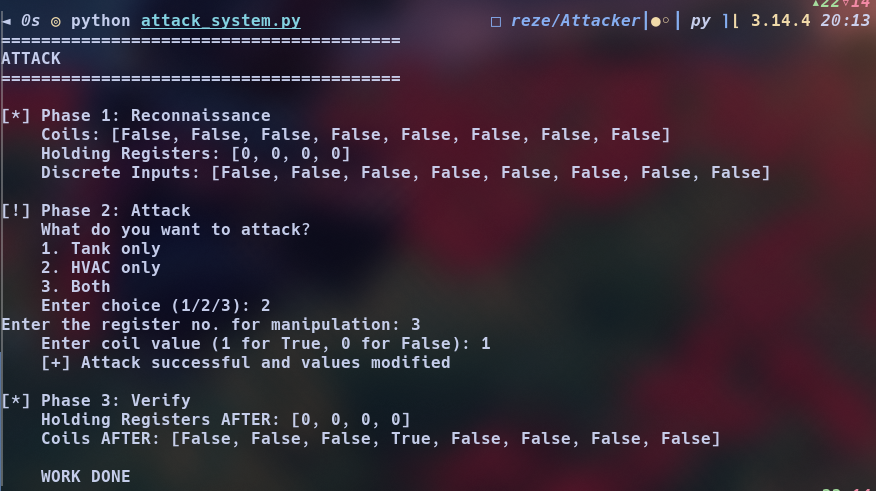

# Reze — Modbus TCP Attack & Detection

A proof-of-concept demonstrating unauthenticated Modbus TCP attacks against an OpenPLC-controlled HVAC and tank system, with a real-time anomaly detector.

Part of the [ICS](https://github.com/Aditya-abs397/ICS) security research repository.

## Overview

Modbus TCP has no native authentication. Any client on the network can read or write PLC memory directly — coils, registers, inputs — without credentials.

This project demonstrates that at the protocol level: an attacker manipulates live PLC state over Modbus, and a detector catches the deviation from baseline in real time.


## Architecture

Attacker  →  Modbus TCP (port 502)  →  OpenPLC (Docker)  →  Detector

## PLC Program

OpenPLC runs a simple HVAC and tank control loop (`OpenPLC/program.st`):

| Variable     | Address | Type             |
|--------------|---------|------------------|
| Occupancy    | %IX0.3  | Discrete Input   |
| HVAC_Enable  | %QX0.3  | Coil             |
| Cooling      | %QX0.0  | Coil             |
| Heating      | %QX0.1  | Coil             |
| Tank_Level   | %MW0    | Holding Register |

Scan cycle: 100ms

## Components

**`Attacker/attack_system.py`**  
Three-phase operation: reconnaissance → write → verify.  
Targets HVAC coils, tank level registers, or both.

**`Detector/detection_system.py`**  
Polls registers every 50ms. Baselines system state on startup.  
Flags coil deviations and register jumps exceeding 50 units per cycle.  
Logs a single timestamped `[ATTACK]` event on first detection with a live status line.

## Setup

**Prerequisites**
- Python 3.x
- OpenPLC Runtime (Docker)
- pymodbus library if not installed it can be by using following command :
- `pip install pymodbus`

**Load PLC Program**  
Import `OpenPLC/program.st` into the OpenPLC dashboard, compile, and start.

## Usage

```bash
# Terminal 1 — start detector first
python3 Detector/detection_system.py

# Terminal 2 — run attack after baseline is captured
python3 Attacker/attack_system.py
```

## Screenshots

**Detector catching live attack**


**Attack script output**


## References

- [Modbus Protocol Specification](https://modbus.org/specs.php)
- [OpenPLC Runtime](https://autonomylogic.com)
- [pymodbus](https://pymodbus.readthedocs.io)

---
Feel free to reach out and contribute.
